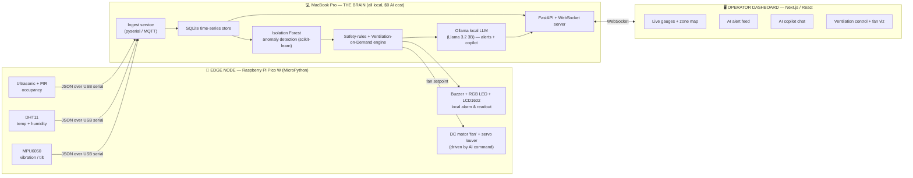

# OreAcle: Master Project Plan
### The offline AI oracle for underground mine intelligence
**Cursor Hackathon Sudbury · "Build the North" · Track 03: Mining & Industrial Innovation**
**Venue:** Laurentian University, Sudbury, Ontario · **Event day:** Saturday, June 27, 2026
**Sponsor:** Key Logic Software · **Builder:** Mihir Trivedi (solo) · **Plan version:** 1.0 (June 21, 2026)

---

> **How to use this document.** This is the single source of truth for the build. Read it top to bottom once. Then work phase by phase. Every phase has (1) a plain-language explanation of what we are doing and why, (2) the technical detail and exact tools, (3) ready-to-paste AI/Cursor prompts so you only have to *code with AI*, not design from scratch, and (4) a **Definition of Done (DoD)** checklist. If you complete every DoD, you have a winning demo. Cut lines are marked **[CUT IF SHORT]**; stretch goals are marked **[STRETCH]**.

---

## Table of Contents

1. [Executive Summary (the 60-second version)](#1-executive-summary)
2. [The Problem: in plain language](#2-the-problem-in-plain-language)
3. [What the industry already does (real companies, real names)](#3-what-the-industry-already-does)
4. [The Gap: where the industry lags](#4-the-gap-where-the-industry-lags)
5. [Our Solution: OreAcle](#5-our-solution-oreacle)
6. [Why this wins this specific hackathon](#6-why-this-wins)
7. [System Architecture](#7-system-architecture)
8. [Hardware: what we use and how (plug-and-play)](#8-hardware)
9. [The AI Stack: open-source, $0 cost, runs on your Mac](#9-the-ai-stack)
10. [Full Tech Stack & Repository Layout](#10-full-tech-stack--repo-layout)
11. [The Phase Plan (Phases 0-6)](#11-the-phase-plan)
12. [Live Demo Script (minute by minute)](#12-live-demo-script)
13. [Pitch & Slide Outline](#13-pitch--slide-outline)
14. [Judging Strategy: how to win the room](#14-judging-strategy)
15. [Risk Register & Contingencies](#15-risk-register--contingencies)
16. [Appendix A: Cursor/AI Prompt Library](#appendix-a-cursorai-prompt-library)
17. [Appendix B: Open-Source Model Selection Table](#appendix-b-model-selection-table)
18. [Appendix C: Public Datasets for Demo Realism](#appendix-c-public-datasets)
19. [Appendix D: Bill of Materials](#appendix-d-bill-of-materials)
20. [Appendix E: Glossary (for non-technical judges)](#appendix-e-glossary)
21. [Appendix F: Sources and Links](#appendix-f-sources-and-links)
22. [Appendix G: One-Page Pre-Flight Checklist](#appendix-g-one-page-checklist)

---

## 1. Executive Summary

**In one sentence:** OreAcle is a free, open-source AI "co-pilot" that watches an underground mine's sensors, spots danger before a human would, explains it in plain English, recommends the exact action, and can even turn up the ventilation fan itself, all running locally on a laptop at **zero AI cost**.

**The 60-second pitch (say this to a judge):**
> "Deep mines are already full of sensors. Maestro Digital Mine has air-quality stations running in Vale's Sudbury mines (including Creighton, at 2.4 km deep) since 2015. Sandvik's Newtrax platform monitors Glencore's people and equipment underground. Vale runs a remote operations centre right here in Sudbury watching all five Ontario mines. So the data exists. **What's missing is the brain and the face.** That raw data still lands as numbers on a screen that a tired supervisor has to interpret under pressure, and the smart interpretation layer is either absent or locked inside expensive proprietary boxes. OreAcle is that missing layer, built with **100% free open-source AI**: it reads the sensors off this little microcontroller, detects the anomaly with machine learning, explains *why* it matters in plain English with a local language model, tells the operator what to do, and drives the fan automatically. This is a proof-of-concept on a $40 board, and the exact same software drops straight onto the infrastructure Vale and Glencore already run."

**What the judges will physically see:** a small board with sensors, a beautiful operator dashboard on the laptop, a live anomaly being detected, an AI writing a plain-English safety alert in real time, and a real fan spinning up when the AI decides ventilation is needed.

**Why it's credible coming from you:** You built the **LoopX Safe & Smart Mining Data Platform** (real-time underground safety dashboards for autonomous equipment), an **offline-first underground inspection app for Vale at Minax**, **Random Forest ML at Laurentian's Mineral Exploration Research Centre** (published in *Ore Geology Reviews*), and an **LLM assistant over operational data at Flosonics**. OreAcle is the intersection of all four. You are arguably the single most qualified person in that room to build exactly this.

---

## 2. The Problem: in plain language

Imagine working two kilometres underground. You can't see the sky. The air you breathe is pumped down to you through giant fans. Three things can quietly kill or injure you, and none of them announce themselves clearly:

1. **Bad air.** Diesel machines give off carbon monoxide and nitrogen dioxide. Blasting leaves behind gases and dust. Oxygen can drop. You often can't smell or feel the danger until it's serious.
2. **Failing equipment.** A pump, fan, conveyor, or drill that's about to break starts vibrating differently *days* before it fails. If nobody notices, it fails catastrophically, expensive and sometimes dangerous.
3. **Wasted (or insufficient) ventilation.** Running every fan at full blast everywhere, all the time, costs a fortune in electricity (ventilation can be 40%+ of a mine's energy bill). Running them too low where people actually are is a safety risk. Matching airflow to where people and machines actually are is hard to do by hand.

Today, a human supervisor sitting at a control screen is expected to watch dozens of live numbers across many zones and mentally connect the dots ("CO is creeping up in Zone 3, two workers are there, the fan is at 40%") and react correctly, fast, every time, for a whole shift. That's a lot to ask of a human, and it's exactly the kind of pattern-watching that machines are good at.

**The plain-language summary of the problem:** *The mine is already measuring everything. It just isn't being understood quickly enough, explained clearly enough, or acted on automatically enough.*

---

## 3. What the industry already does

This section is the backbone of your pitch. Naming real companies and real deployments proves you understand the industry and that your idea is grounded in reality, not invented. **Memorize these.**

### Sensors and data platforms are already deployed at Vale and Glencore

- **Maestro Digital Mine (Sudbury Basin).** Their **Vigilante AQS™** air-quality station measures airflow rate and direction, wet/dry-bulb temperature, gas concentration, and dust particulate. **Hundreds of these units have been running in Vale's underground operations since 2015**, and the product is now in **70+ underground mines globally**. Vale's **Creighton Mine** (where many are deployed) sits at **2,400 m (7,800 ft)**, one of the deepest mines in Canada. Maestro also pioneered **"ventilation on demand."**
- **Newtrax (owned by Sandvik).** Their **Mining Data Platform (MDP)** enables real-time monitoring of **people, equipment, and the environment** underground, OEM-agnostic. In **July 2025, Sandvik and Glencore expanded their partnership** to roll out **Newtrax collision-avoidance** across Glencore's mixed underground fleet, actively being implemented at Glencore's **Raglan nickel mine (Canada)** and **Kamoto Copper (DRC)**.
- **Vale's Integrated Remote Operations Centre (IROC), Sudbury.** Since 2024 it oversees **all five of Vale's Ontario underground mines** from surface, with **Ventilation-on-Demand** systems (LTE-connected) that adjust airflow to activity and, by Vale's own chief ventilation engineer, save **"millions of dollars."**
- **Accutron Instruments (Sudbury).** Their **MAQS** (Mine Air Quality Station) is another commercial gas/air-quality monitoring system used in Northern Ontario mines.

### The hackathon sponsor and its clients

- **Key Logic Software (Sudbury, founded 2009 by Dean Lupini, Waterloo Math + Laurentian Mining Engineering).** Specializes in **embedded systems, 3D applications, AR/VR (the VirtualMine platform), mobile, web/cloud, and custom sensor-data algorithms** for mining. They build the *software that wraps around* mining hardware for clients that don't have their own software teams. Awarded **$105,000 by Ontario's NOHFC** to commercialize their AR mine-training platform.
- **Minewise Technology (Sudbury, est. 1989).** **ShafTrack** multi-laser shaft-guide inspection cut shaft inspection from **up to a week of downtime to a single shift**; also RF/LTE underground video.
- **GeoSight (est. 2011, deployed on six continents).** Cable-free **3D LiDAR cavity scanners** (**NX-150**, borehole **GSM-16**, **Scout**) that map dangerous voids so humans don't have to enter them.
- **TesMan (Sudbury, est. 2003, at NORCAT).** **Remote Loader** robotics keep workers away from the blast face; **May 2026** partnered with explosives maker **Dyno Nobel**; systems cut development/maintenance costs **up to 30%**.

**The takeaway for the pitch:** The Sudbury mining-tech cluster is world-class at **collecting** dangerous-environment data and at **keeping humans out of danger physically**. Everyone in that room respects these companies. OreAcle doesn't compete with them; it **completes** them with the one layer they under-invest in.

---

## 4. The Gap: where the industry lags

There are two gaps, and they are exactly the two things this hackathon (an AI hackathon, judged by a software company) cares about most.

**Gap 1: The AI interpretation layer is thin.** Most deployed systems are excellent at *measuring and displaying*, but the leap from "here are the numbers" to *"here is what's wrong, here is why, and here is what you should do right now"* is still largely done in a human's head, or sold as an expensive add-on. Lightweight, explainable AI that runs on-site and turns multi-sensor noise into a single prioritized, plain-English recommendation is the missing piece.

**Gap 2: The operator interface is built for engineers, not for the person on shift.** Industrial dashboards are dense, technical, and assume the reader already knows what "38 ppm CO at 0.4 m³/s airflow" means. The frontline worker or shift supervisor needs something closer to a clean phone-style app: *green / amber / red, what's happening, what to do, one tap to act.* Practical, human-centred UI is rare underground.

> **One-line framing for the judges:** "Vale and Glencore have the *eyes* (sensors) and increasingly the *muscles* (automation). OreAcle is the open-source, zero-cost **brain and friendly face** that connects them, proved end-to-end on a $40 board."

This framing matters because **Key Logic literally sells "software wrapped around mining hardware" and builds practical UIs and embedded systems.** You are pitching *their core business*, done with modern open-source AI, by someone who has already shipped mining software in Sudbury.

---

## 5. Our Solution: OreAcle

**OreAcle** is a proof-of-concept "digital safety co-pilot" for an underground mine zone. It has four jobs:

1. **Sense.** A Raspberry Pi Pico W microcontroller reads real sensors (vibration, temperature, humidity, occupancy/proximity) from a simulated "mine zone" on your desk and streams them to your MacBook. (Gas/CO is injected in software for the demo; swapping in a real $10 gas sensor is a one-wire change; see Appendix D.)
2. **Think.** On the MacBook, an open-source machine-learning model (**Isolation Forest**, scikit-learn) continuously watches all the sensor channels together and flags anomalies. A safety-rules engine checks hard thresholds (e.g., CO limits, heat-stress index).
3. **Explain & advise.** A **local open-source large language model** (via **Ollama**, running fully offline, **$0 cost**) turns each anomaly into a short plain-English alert *with a recommended action and the reason*, and powers a **chat "copilot"** where a supervisor can ask questions like *"Which zones are unsafe right now and why?"* in natural language.
4. **Act.** A **Ventilation-on-Demand** controller decides the right fan speed from occupancy + air quality and sends the command **back to the Pico W**, which physically **spins the kit's motor/fan** up or down and shows status on its little LCD, completing a real, visible closed loop.

All of this is presented through a **clean, modern operator dashboard** (the part you'll make beautiful): live gauges, a colour-coded zone status, a live alert feed, the AI copilot chat, and the ventilation control with the fan responding in real time.

**Product codename:** *OreAcle.* (Alternative names if you prefer: *DeepVent AI*, *NorthGuard*, *StopeSense*. Pick one and use it consistently on every slide and screen.)

**The promise we put on slide 1:** *"Free, open-source AI safety + ventilation for underground mines, proven end-to-end, from a real sensor to a real action, for $0 in AI cost."*

---

## 6. Why this wins

| Judging factor (typical hackathon) | How OreAcle scores |
| --- | --- |
| **Real problem / domain fit** | Underground air quality, equipment health, and ventilation cost: the three biggest day-to-day mining pain points, named to Vale/Glencore deployments. |
| **Technical impressiveness** | Real hardware + real ML anomaly detection + a real local LLM + a real closed-loop actuator, integrated live. Not a slideware concept. |
| **AI usage (it's an AI hackathon)** | Two kinds of AI working together: classical ML (Isolation Forest) for detection and a generative LLM for explanation/advice. All open-source, all local, $0. |
| **"Wow" / live demo** | A physical anomaly → instant AI plain-English alert → a fan visibly spins up. Judges can trigger it themselves. |
| **Practical UI** | A genuinely usable, modern operator interface, the exact thing the industry lacks and the sponsor sells. |
| **Sponsor relevance (Key Logic)** | It *is* Key Logic's business: software wrapped around mining hardware, embedded + practical UI, mining-domain. |
| **Cursor relevance** | Built fast with Cursor; you can show the AI-assisted workflow that produced it. |
| **Storytelling / credibility** | Named real companies + your own Sudbury mining résumé (LoopX, Vale/Minax, Laurentian ML). |
| **Cost / commercial viability** | $0 AI bill, runs on hardware mines already own. An actual go-to-market, not a science project. |

**The winning sentence:** *"Everything you just saw is open-source and free to run, and it drops straight onto the sensor networks Vale and Glencore already have underground."*

---

## 7. System Architecture

**Plain language:** The little board (Pico W) is the *nervous system*: it feels the world and reports back. Your MacBook is the *brain*: it thinks, decides, explains, and shows everything on screen. The board and the brain talk over a USB cable (simple and rock-solid for a noisy hackathon room), or over Wi-Fi as a stretch goal. The brain can also send a command *back* to the board to spin the fan. That round trip (sense → think → act) is the whole story.



**ASCII fallback (same thing, for slides/README):**

```
  PICO W (sensor node)                 MacBook Pro (the brain)                 Browser (operator UI)
 ┌──────────────────────┐   USB/Wi-Fi  ┌─────────────────────────────┐  WS    ┌──────────────────────┐
 │ MPU6050  (vibration) │──JSON lines──▶│ ingest → SQLite             │        │ live gauges + zones  │
 │ DHT11    (temp/humid)│              │   ↓                          │◀──────▶│ AI alert feed        │
 │ Ultrasonic+PIR (occ.)│              │ IsolationForest + rules (VOD)│  HTTP  │ AI copilot chat      │
 │ Buzzer/RGB/LCD (out) │◀──fan cmd────│   ↓                          │        │ ventilation control  │
 │ DC motor "fan"       │◀─────────────│ Ollama LLM (alerts+copilot)  │        │ (fan spins on screen │
 └──────────────────────┘              │ FastAPI + WebSocket          │        │  AND in real life)   │
   gas/CO = software-injected          └─────────────────────────────┘        └──────────────────────┘
   (swap in $10 MQ sensor = 1 wire)            all open-source · local · $0
```

**Data contract (the one schema everything agrees on).** The Pico W emits one JSON object per reading, ~2/second:

```json
{ "ts": 1750550400, "zone": "Z3", "vib_rms": 0.07, "temp_c": 24.1,
  "humidity": 58, "occupancy": 2, "distance_cm": 180,
  "co_ppm": 12, "no2_ppm": 0.4, "airflow": 0.42, "fan_pct": 40 }
```

`co_ppm`, `no2_ppm`, and `airflow` are **software-simulated** for the POC (clearly labelled "SIM" in the UI). Everything else is a real sensor. This single object flows unchanged through ingest → DB → ML → LLM → UI, which keeps the whole system simple.

---

## 8. Hardware

**Your kit:** *SunFounder Raspberry Pi Pico W Ultimate Starter Kit (Kepler Kit)*, with 450+ parts, fully plug-and-play on a breadboard, no soldering. Everything we need is **in the box**.

> **Spec note (so you can answer judges accurately):** Amazon's listing auto-fills some fields wrong. The board is **not** "Tegra / FreeRTOS." The **Raspberry Pi Pico W** uses the **RP2040** chip: a **dual-core Arm Cortex-M0+ @ 133 MHz, 264 KB SRAM, 2 MB flash**, with **onboard 2.4 GHz Wi-Fi (Infineon CYW43439)**. We program it in **MicroPython**. It is a *microcontroller*, not a Linux computer, which is exactly why the heavy AI runs on the MacBook, not the board. This matches your strategy: **little hardware effort, big software effort.**

### Components we use (all included in the kit)

| Role in OreAcle | Kit component | Interface | Suggested Pico W pin(s) |
| --- | --- | --- | --- |
| Equipment vibration / ground movement | **MPU6050** accel/gyro | I²C (addr 0x68) | SDA=GP0, SCL=GP1 |
| Air temperature + humidity (heat-stress) | **DHT11** | 1-wire digital | GP15 |
| Worker occupancy in zone | **PIR motion sensor** | digital | GP16 |
| Distance / presence (occupancy backup) | **Ultrasonic (HC-SR04)** | trig/echo | TRIG=GP3, ECHO=GP2 |
| Local danger alarm (sound) | **Active buzzer** | digital/PWM | GP14 |
| Local status light (green/amber/red) | **RGB LED** (or WS2812 strip) | PWM | GP18/19/20 |
| Local readout ("VENT ↑ ZONE 3") | **I²C LCD1602** | I²C (addr 0x27) | SDA=GP6, SCL=GP7 |
| The "ventilation fan" (the wow moment) | **DC motor + fan blade** via kit's **motor driver/transistor** | PWM | GP21 |
| Vent louver (optional flourish) | **Servo** | PWM | GP22 |

> **One hardware safety note:** never drive the DC motor directly from a GPIO pin; use the **transistor/motor-driver module included in the kit** (the SunFounder lessons show this exact circuit). The motor has its own power rail. This is the only "real" electronics step; everything else is plug-a-wire-into-a-hole.

### Gas sensing for the demo

You chose **in-box sensors only**, so **CO/NO₂/airflow are simulated in software** and clearly labelled **"SIM"** in the UI. This is honest and still compelling, as the AI logic, thresholds, and alerts are identical whether the number comes from a real sensor or the simulator. **Drop-in path (optional, ~$10, 1 wire):** an **MQ-7 (CO)** or **MQ-2 (combustible gas/smoke)** module on an analog pin replaces the simulator with zero code changes beyond the read function. Mention this to judges as "production swap-in."

### Effort policy (per your goal)

Hardware should take **≈10-12% of total effort**. Use the **SunFounder Kepler online docs / Thonny one-click flashing**, copy their wiring photos, and reuse their example read-code for each sensor verbatim. Do **not** invent circuits. If any single sensor misbehaves for >20 minutes, **drop it** and move on; the architecture survives losing any one channel, and the simulator can cover it.

---

## 9. The AI Stack

Everything here is **open-source and runs locally on your MacBook Pro: no API keys, no internet dependency at demo time, $0 cost.** That "free and offline" property is itself a selling point underground, where connectivity is poor and data is sensitive.

### Your machine (and what it means)

**MacBook Pro 16" (2019): Intel Core i9 8-core, 16 GB DDR4, AMD Radeon Pro 5500M 4 GB, macOS Tahoe 26.5.1.**
- This is an **Intel** Mac, so local LLM tools (Ollama / llama.cpp) run on the **CPU**; Apple's fast "Metal" GPU path is for Apple-Silicon Macs, and the AMD GPU isn't a reliable LLM accelerator. **Plan for CPU inference.**
- **16 GB RAM is plenty** for a 3-billion-parameter model (~3 GB) with room to spare. A 7-8B model also fits but is slower; close other apps if you use one.
- **Recommendation: use a 3B model** (`llama3.2:3b`) as the workhorse; it's fast enough to feel live, and our prompts are short (a sentence or two), which is the easiest possible job for a small model.

### The three AI pieces

1. **Anomaly detection: `scikit-learn` Isolation Forest (REQUIRED).** Classical, tiny, instant, explainable, and *your* skill (Random Forest at Laurentian, scikit-learn on your résumé). It watches all channels together and flags "this combination is abnormal" even when no single value crossed a hard limit. Backed up by simple threshold rules for hard safety limits (CO, heat-stress).
2. **Explanation + copilot: local LLM via `Ollama` (REQUIRED).** Turns an anomaly into a short, plain-English alert *with a recommended action and reason*, and answers operator questions in natural language over the recent sensor data (the same "LLM assistant over operational data" pattern you built at Flosonics).
3. **Voice input: `faster-whisper` (STRETCH, optional).** Lets a supervisor *speak* a question ("hey, is Zone 3 safe?") hands-free. Runs on CPU. Add only if Phases 0-5 are done.

### Model selection (full table in Appendix B)

| Use | Pick | Why |
| --- | --- | --- |
| Alerts + copilot (primary) | **`ollama run llama3.2:3b`** | Fast on CPU, great instruction-following for short outputs |
| If you want crisper reasoning | `phi3.5` or `qwen2.5:3b` | Slightly stronger, similar size |
| If latency is too slow | `gemma2:2b` | Smallest/fastest, still coherent |
| If you want max quality & have time | `llama3.1:8b` / `mistral:7b` | Best wording, ~2-3× slower on your CPU |
| Anomaly detection | `scikit-learn` IsolationForest | Instant, explainable, no model download |

**Golden rule for demo reliability:** keep LLM outputs **short** (≤ 2 sentences) and **pre-warm** the model before you present (run one query so it's loaded in RAM). A snappy small model beats a slow big one in a live demo every time.

---

## 10. Full Tech Stack & Repo Layout

| Layer | Choice | Notes |
| --- | --- | --- |
| Edge firmware | **MicroPython** on Pico W | Flash via **Thonny** (one click) |
| Edge↔Mac link | **USB serial** (pyserial) primary; **MQTT** (Wi-Fi) stretch | Serial = bulletproof in a crowded room |
| Backend | **Python 3.11 + FastAPI + Uvicorn** | WebSocket for live push to UI |
| Storage | **SQLite** | Zero-config time-series; your SQL strength |
| ML | **scikit-learn, numpy, pandas** | Isolation Forest + feature prep |
| LLM runtime | **Ollama** (`llama3.2:3b`) | Local, offline, free |
| Frontend | **Next.js (React) + Tailwind + Recharts** | Your front-end strength; fast, beautiful |
| Realtime | **WebSocket** (native) | Push sensor + alert updates |
| Packaging | **Docker (optional)** + a `make demo` script | One command to launch everything |
| Tooling | **Cursor** (required vibe), **git** | Show the AI-assisted build |

**Repository layout (create this on Day 0):**

```
oreacle/
├── README.md                  # the pitch + run instructions (judges read this)
├── Makefile                   # `make demo` starts everything
├── firmware/
│   └── main.py                # MicroPython: read sensors → print JSON; receive fan cmd
├── backend/
│   ├── ingest.py              # read serial/MQTT → write SQLite
│   ├── db.py                  # SQLite schema + helpers
│   ├── simulator.py           # injects CO/NO2/airflow + "scenario" generator for demo
│   ├── anomaly.py             # IsolationForest train/score + threshold rules
│   ├── vod.py                 # Ventilation-on-Demand controller (occupancy+air → fan %)
│   ├── llm.py                 # Ollama calls: alert text + copilot Q&A (prompts here)
│   ├── api.py                 # FastAPI: REST + WebSocket
│   └── requirements.txt
├── frontend/                  # Next.js app
│   ├── app/ (dashboard, copilot, vent pages)
│   └── components/ (Gauge, ZoneMap, AlertFeed, CopilotChat, FanControl)
├── data/
│   └── oreacle.db        # SQLite (gitignored)
└── docs/
    ├── architecture.png
    └── demo-script.md
```

**Why this layout wins on judging day:** the `README.md` carries the pitch and a one-command run; `make demo` removes live-setup risk; the clean module split means you can demo any one piece even if another breaks.

---

## 11. The Phase Plan

### Timeline at a glance

You receive the kit **Monday, June 22**, and the event is **Saturday, June 27**. That gives you a **5-day prep runway** plus the event day, a major advantage most teams won't use.

| Phase | What | When (2026) | Effort |
| --- | --- | --- | --- |
| **0** | Environment & repo setup (no hardware) | Sun Jun 21 eve - Mon Jun 22 | 2-3 h |
| **1** | Hardware bring-up (sensors → laptop) | Mon Jun 22 - Tue Jun 23 | 3-4 h |
| **2** | The AI brain (ingest, ML, LLM, VOD) | Tue Jun 23 - Wed Jun 24 | 5-7 h |
| **3** | The operator dashboard UI | Wed Jun 24 - Thu Jun 25 | 5-7 h |
| **4** | Integration, closed loop, demo polish | Thu Jun 25 - Fri Jun 26 | 4-6 h |
| **5** | Pitch, story, slides, rehearsal | Fri Jun 26 eve | 2-3 h |
| **6** | Event day: assemble, extend with Cursor, present | Sat Jun 27 | event |

> ** Hackathon-rules note: read this once.** Rules differ on how much you may pre-build. **Universally allowed** before the event: learning the hardware, installing tools, designing the architecture, preparing datasets, and writing your pitch. **Sometimes restricted:** writing the final application code beforehand. **Safe strategy that still wins:** during the prep week, treat Phases 0-4 as *learning + de-risking + building a throwaway practice prototype* so you know exactly what to type. On event day, **rebuild fast in Cursor** (you'll fly, because you've done it once) and use the day to extend and polish. **Confirm the specific event rules** (Luma page / organizers) and, if pre-built code is allowed, simply bring the repo and spend the day going deeper. Either way, the prep week is what separates you from the field.

---

### PHASE 0: Environment and Repo Setup
** Layman's goal:** Get your laptop ready so that the moment the kit arrives, you're building, not installing. Prove the free AI model talks to you.
** When:** Sunday eve June 21 → Monday June 22 (before kit arrives). **No hardware needed.**

**Technical steps**
1. Install tooling: **Homebrew**, **Python 3.11** (`pyenv` or python.org), **Node.js 20 LTS**, **git**, **Cursor**, **Thonny** (for Pico later), **Ollama** (`brew install ollama` or the macOS app).
2. Pull the model and smoke-test it:
   ```bash
   ollama pull llama3.2:3b
   ollama run llama3.2:3b "Reply in one sentence: confirm you are running locally."
 ```
 Also pull a fallback: `ollama pull gemma2:2b`.
3. Create the repo skeleton from §10 (folders + empty files). `git init`, first commit.
4. Python venv + base deps: `pip install fastapi uvicorn pyserial scikit-learn pandas numpy requests ollama paho-mqtt`.
5. Scaffold the Next.js app: `npx create-next-app@latest frontend` (TypeScript, Tailwind, App Router).
6. Write a 3-line `llm.py` that calls Ollama and prints a response, confirming Python → local LLM works end-to-end.

** Cursor prompt to paste**
> "Create a Python module `backend/llm.py` using the `ollama` Python package. Expose `generate_alert(context: dict) -> str` and `ask_copilot(question: str, recent_rows: list[dict]) -> str`. Both call a local model (default `llama3.2:3b`, configurable via env var `OR_MODEL`). Keep outputs under 2 sentences. Add a `__main__` block that runs a sample call and prints the result. Include a timeout and a graceful fallback string if Ollama isn't running."

** Estimate:** 2-3 h. **[CUT IF SHORT]** Docker; MQTT broker (use serial).

** Definition of Done: Phase 0**
- [ ] `ollama run llama3.2:3b` returns a sentence in < 5 s.
- [ ] `python backend/llm.py` prints an LLM response (Python → local model works).
- [ ] Repo skeleton committed to git; Next.js app runs at `localhost:3000` (default page).
- [ ] All CLI tools installed and on PATH (`python`, `node`, `ollama`, `git`, `thonny`).
- [ ] You can explain, in one breath, why the LLM runs on the Mac and not the Pico.

---

### PHASE 1: Hardware Bring-Up
** Layman's goal:** Make the little board feel the world and shout the numbers to your laptop over the USB cable. Keep it dead simple.
** When:** Monday June 22 (kit arrives) → Tuesday June 23.

**Technical steps**
1. **Flash MicroPython:** open **Thonny → Run → Configure interpreter → MicroPython (Raspberry Pi Pico) → Install/Update firmware.** One click. (Follow the SunFounder Kepler "Get Started" page.)
2. **Bring up each sensor one at a time** using SunFounder's example code (copy their lesson code verbatim): DHT11 → MPU6050 (I²C) → PIR → ultrasonic → LCD → buzzer/RGB → motor (via the kit's driver). Confirm each prints sane values in Thonny's shell.
3. **Write `firmware/main.py`:** every ~0.5 s, read all sensors, assemble the §7 JSON object, and `print()` it as one line over USB serial at 115200 baud. Add a tiny serial-input reader so an incoming `{"fan_pct": 80}` sets the motor PWM (this is the "act" path).
4. **Prove the link from the Mac:** a 10-line `pyserial` script that opens the port, reads lines, and prints parsed JSON.

** Cursor prompts to paste**
> (firmware) "Write MicroPython `main.py` for a Raspberry Pi Pico W. Read DHT11 on GP15, MPU6050 over I²C0 (SDA GP0/SCL GP1) computing a vibration RMS from accelerometer magnitude, PIR on GP16, HC-SR04 ultrasonic (TRIG GP3/ECHO GP2) for distance_cm, and drive a buzzer GP14, RGB LED GP18/19/20, I²C LCD1602 (I²C1 SDA GP6/SCL GP7), and a DC motor PWM on GP21. Every 500 ms, print one JSON line with keys ts, zone='Z3', vib_rms, temp_c, humidity, occupancy (1 if PIR or distance<200cm else 0), distance_cm, fan_pct. Also non-blockingly read stdin for a JSON command `{\"fan_pct\": N}` and set motor PWM + show 'VENT N%' on the LCD. Use only standard MicroPython libs; include the LCD I2C driver inline."
>
> (host check) "Write `backend/serial_check.py` using pyserial: auto-detect the Pico's serial port, read lines at 115200, parse each as JSON, and pretty-print. Handle malformed lines gracefully."

** Estimate:** 3-4 h. **MVP:** DHT11 + MPU6050 + PIR + motor + LCD. **[CUT IF SHORT]** ultrasonic, servo louver, WS2812 strip. **Hard rule:** any sensor that fights you for >20 min gets dropped and simulated.

** Definition of Done: Phase 1**
- [ ] Pico W runs MicroPython and auto-starts `main.py` on power-up.
- [ ] One clean JSON line per ~0.5 s appears over USB serial with real values that change when you tap/breathe-on/wave-at the sensors.
- [ ] Sending `{"fan_pct": 80}` from the Mac **physically speeds up the motor/fan** and updates the LCD.
- [ ] Mac-side `serial_check.py` parses and prints the stream with no crashes for 2 minutes.
- [ ] At least **3 real sensor channels** are live (vibration, temp/humidity, occupancy).

---

### PHASE 2: The AI Brain
** Layman's goal:** Teach the laptop to store the readings, notice when something's wrong, decide how much fan is needed, and write a human a plain-English warning, all locally, for free.
** When:** Tuesday June 23 → Wednesday June 24. **This is the most important phase. Spend your best hours here.**

**Technical steps**
1. **Ingest → SQLite (`ingest.py`, `db.py`).** Read the serial stream, write every reading into a `readings` table. Keep an in-memory rolling window (last N minutes) for fast scoring.
2. **Simulator (`simulator.py`).** Inject `co_ppm`, `no2_ppm`, `airflow` (labelled SIM). Crucially, build a **scenario generator**: named, repeatable sequences (`normal`, `gas_buildup`, `bearing_failure`, `blast_clearance`) so your live demo is deterministic and you can trigger any story on cue.
3. **Anomaly detection (`anomaly.py`).** Train an **IsolationForest** on a "normal" baseline (a few minutes of normal readings or synthetic normal data). Score each new reading; expose `is_anomaly` + an anomaly score. Add **hard-threshold rules** (e.g., CO > 35 ppm = danger; heat-stress index from temp+humidity; vib_rms > X = equipment fault). Combine ML + rules into a single `status` per zone: `OK / WATCH / ALERT`.
4. **Ventilation-on-Demand (`vod.py`).** Pure function: given occupancy + air quality + temp, output a target `fan_pct` (e.g., baseline 30%; +per person; +scaled to CO/heat; clamp 0-100). This mirrors Vale's real VOD logic. Send the setpoint to the Pico.
5. **LLM alerts (`llm.py`).** When status escalates, call the local LLM with a tight prompt → a 1-2 sentence alert *with cause + recommended action*. Cache/debounce so it doesn't spam.

** Cursor prompts to paste**
> (anomaly) "Implement `backend/anomaly.py`. Train a scikit-learn IsolationForest on a pandas DataFrame of baseline readings (features: vib_rms, temp_c, humidity, co_ppm, no2_ppm, airflow). Provide `score(reading: dict) -> {anomaly: bool, score: float}`. Add `rule_check(reading)` for hard limits: co_ppm>35 → 'ALERT gas', heat_index(temp,humidity)>32 → 'WATCH heat', vib_rms>0.25 → 'ALERT vibration'. Provide `assess(reading) -> {status: 'OK|WATCH|ALERT', reasons: [..]}` combining ML + rules."
>
> (VOD) "Implement `backend/vod.py` with `target_fan_pct(occupancy, co_ppm, temp_c) -> int`: base 30, +15 per occupant (cap +45), +scaled term so co_ppm 35→+40 linearly, +heat term, clamp 0..100. Pure, documented, unit-tested."
>
> (LLM prompt design) "In `backend/llm.py`, set the alert system prompt to: 'You are OreAcle, an underground-mine safety co-pilot. Given sensor JSON and detected reasons, write ONE urgent sentence a shift supervisor can act on: state the zone, the hazard, and the single recommended action. No preamble.' Provide `generate_alert(zone, reading, reasons)`. Add `ask_copilot(question, recent_rows)` that answers from the provided rows only, and says 'insufficient data' if unknown."

** Estimate:** 5-7 h. **MVP:** ingest + IsolationForest + rules + one LLM alert. **[STRETCH]** copilot Q&A, debounce tuning, multi-zone.

** Definition of Done: Phase 2**
- [ ] Live readings persist to SQLite; you can `SELECT` recent rows.
- [ ] Scenario generator can deterministically produce `gas_buildup` and `bearing_failure` on command.
- [ ] IsolationForest + rules output a correct `OK/WATCH/ALERT` status that flips when you trigger a scenario.
- [ ] VOD function raises target fan % when occupancy/CO rise, and the **Pico fan actually responds**.
- [ ] The local LLM produces a correct, ≤ 2-sentence alert naming the zone, hazard, and action, in under 4 s, offline.

---

### PHASE 3: The Operator Dashboard UI
** Layman's goal:** Build the beautiful, genuinely usable screen that makes judges go "oh, *that's* how it should look." This is your differentiator; spend real care here.
** When:** Wednesday June 24 → Thursday June 25.

**Design principles (the "practical UI" the industry lacks)**
- **Glanceable:** a tired person sees green/amber/red and the headline in < 2 seconds.
- **Plain words first, numbers second.** The AI's sentence is the hero; gauges support it.
- **Dark, high-contrast, control-room aesthetic.** Large type. One screen, no scrolling to the important stuff.
- **Action-oriented:** every alert shows the recommended action and a button.

**Screens / components**
1. **Live overview:** zone status cards (OK/WATCH/ALERT), big headline alert, ventilation state with an animated fan whose speed matches the real motor.
2. **Gauges & trends:** vibration, temp/humidity, CO (SIM tag), and airflow via Recharts sparklines.
3. **AI alert feed:** timeline of LLM-written alerts with timestamps and severity colour.
4. **AI copilot chat:** ask "Which zones are unsafe and why?" → LLM answers from live data.
5. **Ventilation control:** Auto (VOD) vs Manual toggle; slider sends `fan_pct` to the Pico; shows the closed loop.

** Cursor prompts to paste**
> "Build a Next.js (App Router, TypeScript, Tailwind) operator dashboard for OreAcle. Connect to a WebSocket at ws://localhost:8000/ws receiving the reading+status JSON. Create components: `ZoneStatusCard` (green/amber/red, headline), `Gauge` (Recharts radial), `TrendSparkline`, `AlertFeed` (severity-coloured list), `CopilotChat` (POST /copilot), `FanControl` (Auto/Manual, slider POST /fan). Control-room dark theme, large legible type, responsive. Add a subtle animated fan SVG whose rotation speed = fan_pct. Mark simulated values with a small 'SIM' badge."
>
> "Add a top status bar that turns red and pulses when any zone is ALERT, with the AI's headline sentence in large text and a 'Recommended action' chip."

** Estimate:** 5-7 h. **MVP:** overview + alert feed + copilot. **[STRETCH]** trends page, manual vent slider, animated mine map.

** Definition of Done: Phase 3**
- [ ] Dashboard shows **live** data via WebSocket, updating ~2×/sec without flicker.
- [ ] Triggering `gas_buildup` flips a zone card to red and shows the AI's plain-English headline + action within a few seconds.
- [ ] Copilot chat answers a real question from live data correctly.
- [ ] Fan control sends a setpoint that visibly changes both the on-screen fan **and** the real motor.
- [ ] It looks polished enough to screenshot for slide 1: dark, clean, glanceable.

---

### PHASE 4: Integration, Closed Loop and Demo Polish
** Layman's goal:** Wire everything into one smooth story that runs with a single command and survives a chaotic demo room. Make the "wow" moment bulletproof.
** When:** Thursday June 25 → Friday June 26.

**Technical steps**
1. **One-command launch.** A `Makefile` / script that: starts Ollama, runs ingest, starts FastAPI, launches Next.js. Add a `--sim` flag that runs the **whole system with no hardware** (simulator feeds the pipeline) as your safety net.
2. **Close the loop end-to-end.** Confirm: scenario → anomaly → status → LLM alert → UI red → VOD raises fan → **real motor spins** → buzzer/RGB/LCD react. Time it; tune debounce so it feels instant but not flickery.
3. **Author the demo scenarios.** Lock 2-3 button-triggered stories with clean before/after: **(a) Gas build-up in an occupied zone**, **(b) Bearing/equipment failure (vibration)**, optional **(c) Blast-clearance ventilation**. Each should resolve visibly when the fan ramps.
4. **Pre-warm + fail-safes.** Auto-run one LLM query at startup (load model into RAM). If serial drops, auto-fallback to `--sim` without crashing. Cache the last good LLM alerts so the feed is never empty.
5. **Harden the UI.** Loading states, empty states, a "Demo Controls" panel (hidden hotkey) to fire scenarios on cue.

** Cursor prompts to paste**
> "Create a `Makefile` with `make demo` that launches Ollama (if not running), `backend/ingest.py`, `uvicorn backend.api:app`, and the Next.js dev server concurrently, and `make sim` that runs everything in hardware-free simulation mode. Add graceful shutdown."
>
> "Add a hidden 'Demo Controls' panel (toggle with the \` key) to the dashboard with buttons: Normal, Trigger Gas Buildup, Trigger Bearing Failure, Trigger Blast Clearance, Reset. Each POSTs to /scenario/{name}."

** Estimate:** 4-6 h. **MVP:** `make demo` + `make sim` + 2 clean scenarios + closed loop. **[STRETCH]** scenario (c), Docker, multi-zone map.

** Definition of Done: Phase 4**
- [ ] `make demo` brings up the entire system in one command; `make sim` runs it with **no hardware**.
- [ ] The full closed loop works on cue: trigger → AI alert → UI red → fan spins → resolves.
- [ ] Two demo scenarios are repeatable and reset cleanly; total "wow" sequence ≤ 60 s.
- [ ] Pulling the USB cable mid-demo does **not** crash the app (auto-fallback to sim).
- [ ] The LLM is pre-warmed; first alert appears with no awkward cold-start delay.

---

### PHASE 5: Pitch, Story and Slides
** Layman's goal:** Package the build into a 3-4 minute story that any judge (technical or not) finds obvious, credible, and impressive. The build is only half the score; this is the other half.
** When:** Friday June 26 evening.

**Technical/creative steps**
1. **Slides (≤ 8).** Use the outline in §13. One idea per slide, big visuals, a screenshot of your dashboard on slide 1.
2. **Memorize the named examples** (§3): Vale/Creighton/Maestro Vigilante AQS, Newtrax/Sandvik/Glencore, Vale IROC + VOD, Accutron, Key Logic + Minewise/GeoSight/TesMan. Drop 2-3 names naturally; don't list them all.
3. **Write the README** as a mini-pitch (problem → solution → architecture image → `make demo`). Judges browse repos.
4. **Rehearse the demo script (§12) three times**, including the failure-recovery line ("and because it's all local, even if I lose the cable, the system keeps running in simulation (like this)").
5. **Prepare the Q&A** (Appendix-style): cost (\$0), privacy (all local/offline), scalability (drops onto existing sensor networks), "why not just buy Maestro?" (you complement it with the open AI + UI layer), accuracy/false-alarms (ML + rules + human-in-the-loop).

** Cursor/AI prompt to paste**
> "From this README and architecture, draft an 8-slide pitch script for a 3-minute mining-AI hackathon demo. Slide 1 a one-line value prop, slides on problem (with Vale/Maestro/Glencore named), solution, live-demo cue, AI stack ($0 open-source), why-it-matters/commercial, and a closing line. Give speaker notes ≤ 30 words per slide."

** Estimate:** 2-3 h.

** Definition of Done: Phase 5**
- [ ] ≤ 8 slides exist, slide 1 shows your real dashboard and the one-line promise.
- [ ] You can deliver the 3-minute pitch from memory, naming ≥ 2 real companies correctly.
- [ ] README runs anyone from clone → `make demo` (or `make sim`) in under 5 minutes.
- [ ] You have crisp answers to the five likely Q&A questions.
- [ ] Demo rehearsed end-to-end at least 3×, including the failure-recovery moment.

---

### PHASE 6: Event Day, Assemble, Extend, Present
** Layman's goal:** Show up calm, set up fast, use the day to go deeper with Cursor, and deliver a clean, confident demo.
** When:** Saturday June 27 (event).

**Run-of-day**
1. **Arrive early; set up the physical node** (breadboard pre-wired the night before, taped to a small board so nothing pops loose in transit). Test `make demo` on venue power and, if needed, the venue Wi-Fi (but you default to USB serial, so Wi-Fi issues don't matter).
2. **Use Cursor live** to add a visible improvement or two during the event (extra scenario, nicer animation, a copilot capability, and *narrate that you're using Cursor*, which resonates with this hackathon's format. Commit often.
3. **Lock the build ~60-90 min before judging.** Stop adding features; rehearse twice more; charge the laptop; silence notifications; set screen to the dashboard.
4. **Submit** whatever the platform requires (Devpost/Luma): repo link, 1-2 min video (record a clean run as backup in case live fails), and the README.
5. **Present** per §12. Invite a judge to trigger a scenario themselves.

** Estimate:** event hours. **MVP:** a flawless run of the Phase-4 demo. **[STRETCH]** one new Cursor-built feature shown live.

** Definition of Done: Phase 6**
- [ ] Physical node set up and `make demo` verified on venue power before judging.
- [ ] A backup **screen-recording** of a perfect run is saved locally and uploaded.
- [ ] Submission complete on the event platform (repo + video + README) before deadline.
- [ ] Demo delivered in ≤ 4 min with a judge triggering the live anomaly.
- [ ] You named real companies and your own mining track record in the pitch.

---

## 12. Live Demo Script
*(~3.5 minutes. Practice until it's muscle memory. Italics = what you do; quotes = what you say.)*

**[0:00, Hook]** *Dashboard on the big screen, all zones green.*
> "This is a live underground mine zone. Real sensors on this board are feeding my laptop right now. Everything you'll see runs **100% locally on free, open-source AI**, no cloud, no API bill. Watch what happens when the air goes bad."

**[0:25, The anomaly]** *Trigger 'Gas Buildup' (or breathe on / tap the sensor for the real channels). A zone card flips amber → red; the top bar pulses.*
> "CO is climbing in Zone 3, and there are two workers there. A human watching forty numbers might miss this. OreAcle didn't."

**[0:50, The AI explains]** *Point to the AI alert sentence appearing in real time.*
> "Our local language model just wrote this, in plain English: *'Zone 3: CO rising with workers present. Increase ventilation now and verify diesel equipment.'* That's the missing layer: not data, but a **decision**."

**[1:20, The closed loop, the wow]** *The on-screen fan accelerates; the real motor on the board spins up audibly; the LCD shows 'VENT ↑'.*
> "And it doesn't just warn; it acts. Ventilation-on-Demand just raised the fan, on the screen **and on the board**. This is exactly the logic Vale uses underground to save millions; it's open-source here."

**[1:50, The copilot]** *Type into the chat: "Which zones are unsafe and why?"*
> "A supervisor can just ask. *'Zone 3 is in alert: elevated CO with occupancy; ventilation raised to 85%.'* Natural language, answered from live data, offline."

**[2:20, Reset and second scenario]** *Reset to green; trigger 'Bearing Failure'.*
> "Different hazard: equipment. Vibration just spiked; the model flags an impending bearing failure before it breaks. Same brain, same interface."

**[2:45, The industry frame]** *Back to overview.*
> "Maestro already streams air quality from Vale's Creighton Mine, 2.4 km down. Sandvik's Newtrax watches Glencore's fleet. The sensors exist. What's missing (and what Key Logic's whole business is about) is the **AI brain and a usable interface**. We built it, free, in a week, and it drops onto the hardware they already run."

**[3:10, Close, credibility, invite]**
> "I'm Mihir: I built LoopX's mining safety platform and Vale's underground inspection app, right here in Sudbury. **Want to set off the alarm yourself?**" *Hand a judge the board.*

> **Failure-recovery line (keep in your back pocket):** "Because it's all local, if I lose this cable the system keeps running in simulation (switch to `make sim`) and it never goes dark."

---

## 13. Pitch & Slide Outline
*(≤ 8 slides. One idea each. Big visuals. Your dashboard screenshot is the star of slide 1.)*

1. **Title + promise.** "OreAcle: the offline AI oracle for underground mine intelligence." Dashboard screenshot. Your name + "$0 AI cost."
2. **The problem (human).** Two km down: bad air, failing equipment, wasted ventilation. One photo, three icons.
3. **The industry today (credibility).** Logos/names: Vale (Creighton, IROC, VOD), Maestro Vigilante AQS, Newtrax/Sandvik + Glencore, Accutron. "The sensors already exist."
4. **The gap.** "Data ≠ decisions. Engineer dashboards ≠ frontline tools." The two missing layers: AI brain + usable UI.
5. **Our solution.** The sense→think→explain→act diagram (§7). Emphasize open-source + local + free.
6. **Live demo.** One line: "Let me show you." (Then switch to the app, the demo *is* the slide.)
7. **Why it matters / commercial.** $0 AI, offline (privacy + no connectivity needed underground), drops onto existing Maestro/Newtrax/Vale infrastructure; directly Key Logic's business model.
8. **Who built it + close.** Your Sudbury mining résumé (LoopX, Vale/Minax, Laurentian ML, Flosonics LLM). "Built with Cursor in a week. Free to run forever."

---

## 14. Judging Strategy: how to win the room

**Know your two audiences.**
- **Key Logic (the sponsor).** They sell *software wrapped around mining hardware*, embedded systems, and practical UIs. Speak to **commercial viability, embedded integration, and clean UX**. Name their clients' problems (cavity scanning, shaft inspection, remote loading) to show you did the homework, and position OreAcle as the AI/UI layer *complementing* their world, not competing.
- **Cursor / AI-hackathon judges.** They reward **ambitious, working AI built fast**. Emphasize two AI techniques (ML + LLM), that it's **open-source and $0**, and that you used **Cursor** to ship it. Show a commit history or a live Cursor edit.

**Five power moves**
1. **Make a judge trigger the anomaly.** Interaction beats narration.
2. **Say "$0" and "offline" out loud.** Cost and connectivity are real mining constraints; you nailed both.
3. **Name-drop precisely, not exhaustively.** 2-3 real deployments (Vale/Maestro, Glencore/Newtrax) = credibility; ten names = noise.
4. **Lead with your résumé once, briefly.** "I built mining safety software for LoopX and Vale here in Sudbury" earns instant trust, then let the demo talk.
5. **Have the backup video + `make sim`.** Calm under failure signals senior engineering.

**Anticipated questions & crisp answers**
- *"Why not just buy Maestro/Newtrax?"* → "You'd still need the AI interpretation and a frontline UI on top. That's exactly this layer, and it's open-source so it's vendor-neutral across all their sensors."
- *"How accurate / false alarms?"* → "ML catches subtle multi-sensor patterns; hard rules catch known limits; a human confirms. Tunable, with the human in the loop."
- *"Does the AI cost anything?"* → "Zero. Everything runs locally on a laptop, no API, no internet needed underground."
- *"Can it scale to a real mine?"* → "Each zone is one node; the brain ingests any number; it speaks the same data these systems already produce."
- *"What did you build today vs. before?"* → Be honest, show Cursor usage and commits.

---

## 15. Risk Register & Contingencies

| # | Risk | Likelihood | Impact | Mitigation / Contingency |
| --- | --- | --- | --- | --- |
| R1 | Kit arrives late / DOA | Low | High | Build and demo entirely in **`make sim`** mode; the full pipeline needs no hardware. Hardware is the garnish, not the meal. |
| R2 | A sensor won't cooperate | Med | Low | 20-min rule: drop it, simulate that channel. Architecture survives losing any one input. |
| R3 | Local LLM too slow in demo | Med | Med | Use `llama3.2:3b` or `gemma2:2b`, keep outputs ≤ 2 sentences, **pre-warm** at startup, cache last alerts. |
| R4 | Venue Wi-Fi flaky | High | Low | Default to **USB serial**; everything is **offline**. Wi-Fi is a stretch path only. |
| R5 | Live demo crash | Med | High | One-command `make demo`, auto-fallback to sim on serial loss, and a **recorded backup video**. |
| R6 | Motor/driver wiring issue | Med | Low | Fan is one of several "act" signals (buzzer/RGB/LCD also show action); on-screen fan always works. |
| R7 | Pre-built-code rules dispute | Low | Med | Confirm rules; if restricted, **rebuild in Cursor on the day** (you've rehearsed it) and keep prep as learning/design. |
| R8 | Time overrun in prep | Med | Med | Follow MVP markers; cut **[CUT IF SHORT]** items first; Phases 2 & 3 are non-negotiable, the rest are polish. |
| R9 | Nerves / pitch fumble | Med | Med | Memorize §12, rehearse 3×, keep the failure-recovery line ready; let the interactive demo carry you. |
| R10 | Laptop battery / thermal | Low | Med | Bring charger, present plugged in, close other apps (helps LLM speed too). |

---

## Appendix A: Cursor/AI Prompt Library

Paste these into Cursor (or Claude) in order. Each is self-contained. Tip: keep the repo open in Cursor so it has context; reference file paths explicitly.

**A0: Project bootstrap**
> "Set up a Python 3.11 + FastAPI backend and a Next.js (TS, Tailwind, App Router) frontend in this repo following this structure: [paste §10 tree]. Create empty modules with docstrings describing each one's responsibility. Add `backend/requirements.txt` with fastapi, uvicorn, pyserial, scikit-learn, pandas, numpy, ollama, paho-mqtt. Add a root `Makefile` with `demo` and `sim` targets."

**A1: Firmware (Pico W / MicroPython).** See Phase 1 prompt.

**A2: Serial bridge.** See Phase 1 host-check prompt, then:
> "Extend `backend/ingest.py` to read the Pico serial stream, validate each JSON reading against a schema, write to SQLite via `backend/db.py`, and keep an in-memory deque of the last 600 readings per zone. Expose `latest()` and `window(minutes)`."

**A3: Database**
> "Write `backend/db.py`: SQLite with a `readings` table (all keys from the §7 schema + an `id` and indexed `ts`) and an `alerts` table (ts, zone, severity, text). Provide insert + query helpers and `init_db()`."

**A4: Simulator and scenarios**
> "Write `backend/simulator.py` that (1) augments each real reading with simulated co_ppm, no2_ppm, airflow, and (2) provides a `Scenario` engine with named scripts: 'normal', 'gas_buildup' (CO ramps 10→60 ppm over 20 s with occupancy=2), 'bearing_failure' (vib_rms ramps 0.05→0.4), 'blast_clearance' (CO high then airflow rises). Expose `start(name)`, `reset()`, and `current()` so the API can trigger them."

**A5: Anomaly + rules.** See Phase 2 anomaly prompt, then:
> "Add unit tests in `backend/test_anomaly.py` proving OK on normal input and ALERT on gas_buildup/bearing_failure samples."

**A6: Ventilation-on-Demand.** See Phase 2 VOD prompt.

**A7: LLM alerts + copilot.** See Phase 0 and Phase 2 LLM prompts.

**A8: API**
> "Write `backend/api.py` (FastAPI): a WebSocket `/ws` that pushes each new reading+assessment ~2×/s; `POST /copilot` {question} → LLM answer over the recent window; `POST /fan` {fan_pct} → forward to the Pico over serial; `POST /scenario/{name}` → start a scenario. Enable CORS for localhost:3000."

**A9: Dashboard.** See Phase 3 prompts.

**A10: Demo controls + Makefile.** See Phase 4 prompts.

**A11: README (judges read this)**
> "Write a `README.md` for OreAcle: one-line value prop, the problem (name Vale/Maestro/Glencore/Newtrax), an architecture image, the open-source/$0 AI stack, and a Quick Start (`make demo` and hardware-free `make sim`). Tone: confident, concrete, recruiter-readable."

**A12: Pitch script.** See Phase 5 prompt.

---

## Appendix B: Model Selection Table

All via **Ollama**, local, offline, free. Tuned for your **Intel i9 / 16 GB / CPU-inference** Mac.

| Model (Ollama tag) | Params | ~RAM (Q4) | Feel on your Mac (CPU) | Best for | Verdict |
| --- | --- | --- | --- | --- | --- |
| `llama3.2:3b` | 3B | ~3 GB | Snappy for short outputs | Alerts + copilot | **Primary** |
| `gemma2:2b` | 2B | ~2 GB | Fastest | Latency fallback | Safety net |
| `phi3.5` | 3.8B | ~3 GB | Snappy, strong reasoning | Crisper alerts | Alt |
| `qwen2.5:3b` | 3B | ~3 GB | Snappy, good structured output | Copilot Q&A | Alt |
| `llama3.1:8b` | 8B | ~5-6 GB | Slower (~2-3×) | Max wording quality | Stretch only |
| `mistral:7b` | 7B | ~5 GB | Slower | Quality alt | Stretch only |
| **scikit-learn IsolationForest** | N/A | tiny | Instant | Anomaly detection | **Required** |
| `faster-whisper` (base) | N/A | ~0.2 GB | Near real-time | Voice input | Stretch |

**Operating rules:** keep prompts short; pre-warm before demo; set `OR_MODEL` env var to switch models without code changes; if a model stalls, fall back to `gemma2:2b`.

---

## Appendix C: Public Datasets for Demo Realism
*(Optional: use to pre-train the anomaly model or to cite "trained on real industrial data." Not required; the simulator suffices.)*

| Dataset | What it is | Use in OreAcle | Where |
| --- | --- | --- | --- |
| **NASA Bearing (IMS)** | Run-to-failure vibration of bearings | Pre-train/validate the vibration → failure story | Kaggle / NASA PCoE |
| **FEMTO-PRONOSTIA** | Accelerated bearing degradation | Same; richer features | Kaggle / academic mirrors |
| **Pump Sensor Data** | 52 sensors, labelled failures | Multivariate anomaly demo | Kaggle (`nphantawee/pump-sensor-data`) |
| **MSHA Accident & Injuries** | US mine-safety incident records | Cite scale of the safety problem | data.gov / MSHA |
| **Ontario AMIS** | Abandoned mines inventory (ON) | Local/regional framing | geologyontario (MNDM) |
| **NIOSH mining** | Health/exposure research | Air-quality framing | CDC/NIOSH |

> Honesty rule: if you train on a dataset, say so; if you simulate, say "physics-based simulation, swappable for live sensors." Never imply real mine data you don't have.

---

## Appendix D: Bill of Materials

| Item | Source | Cost | Status |
| --- | --- | --- | --- |
| Raspberry Pi Pico W + breadboard, wires, all sensors (DHT11, MPU6050, PIR, ultrasonic, LCD1602, buzzer, RGB LED, DC motor + driver, servo) | **In your SunFounder Kepler kit** | **$0 (owned)** | Ordered, arrives ~Jun 22 |
| USB cable (Pico ↔ Mac) | In kit | $0 | |
| Laptop, Ollama models, all software | Owned / open-source | **$0** | |
| *(Optional)* MQ-7 (CO) or MQ-2 gas sensor module | Amazon Prime | **~$10** | Optional production-swap demo |
| **Total required spend** | | **$0** | |

**Headline for the pitch:** *"Total bill of materials for the AI: zero. It runs on hardware mines already own."*

---

## Appendix E: Glossary (for non-technical judges)

- **Edge device / microcontroller:** a tiny low-power computer (the Pico W) that reads sensors near where the action is. Too small to run big AI itself.
- **Open-source AI:** AI models anyone can download and run for free, with no usage fees and no data leaving your machine.
- **LLM (Large Language Model):** the kind of AI that reads and writes human language (here, it writes the safety alerts and answers questions).
- **Local / offline inference:** running the AI entirely on your own laptop, with no internet, important underground and for data privacy.
- **Anomaly detection:** software that learns what "normal" looks like and flags anything unusual, even subtle combinations.
- **Isolation Forest:** a specific, lightweight anomaly-detection algorithm; fast and explainable.
- **Ollama:** a free tool that runs open-source LLMs locally with one command.
- **Ventilation-on-Demand (VOD):** running mine fans only as hard as needed, where people actually are, to save energy and stay safe.
- **ppm:** parts per million; how gas concentration (e.g., carbon monoxide) is measured.
- **Vibration RMS:** a single number summarizing how much a machine is shaking; rising RMS often precedes failure.
- **Closed loop:** the system doesn't just warn, it acts (raises the fan) and you can see the result.
- **WebSocket:** the live connection that pushes new readings to the dashboard instantly.

---

## Appendix F: Sources and Links

**Event & sponsor**
- Cursor Hackathon Sudbury: [Cursor forum announcement](https://forum.cursor.com/t/new-event-cursor-hackathon-sudbury/160832) · [Luma event page](https://luma.com/cursor-llwi)
- Key Logic Software: [site](https://www.keylogicsoftware.com) · [about](https://www.keylogicsoftware.com/about) · [embedded systems](https://www.keylogicsoftware.com/embedded-systems) · [projects](https://www.keylogicsoftware.com/projects) · [MineConnect profile](https://mineconnect.com/corporate-members/key-logic-inc/)

**Real-world mining-AI / IoT (your named examples)**
- Maestro Digital Mine: [Vigilante AQS air-quality station](https://www.maestrodigitalmine.com/products/vigilante-aqs-air-quality-station) · [Vale Creighton case study (PDF)](https://www.maestrodigitalmine.com/images/case-studies/Plexus-Case-Study-Vale-Creighton.pdf) · [MineConnect profile](https://mineconnect.com/corporate-members/maestro-digital-mine/)
- Newtrax / Sandvik + Glencore: [Sandvik-Glencore Newtrax collision-avoidance expansion (Jul 2025)](https://www.mining.sandvik/en/news-and-media/news-archive/2025/07/sandvik-glencore-expand-partnership-to-include-newtrax-collision-avoidance-technology/) · [Newtrax Mining Data Platform](https://www.mining.sandvik/en/digital-solutions/operations-and-connected-fleet/mixed-fleet-telemetry/) · [International Mining coverage](https://im-mining.com/2025/07/14/sandvik-glencore-expand-partnership-to-include-newtrax-collision-avoidance-tech/)
- Vale Sudbury: [IROC oversees all 5 Ontario mines (International Mining)](https://im-mining.com/2024/01/11/vale-base-metals-iroc-in-sudbury-now-overseeing-all-five-of-its-ontario-mines/) · [Vale's digital evolution (Sudbury.com)](https://www.sudbury.com/local-news/vales-digital-evolution-takes-shape-1703581) · [Mine ventilation goes digital (Northern Ontario Business)](https://www.northernontariobusiness.com/industry-news/mining/mine-ventilation-goes-digital-759997)
- Accutron Instruments: [MAQS Mine Air Quality Station](https://accutroninstruments.com/maqs-mine-air-quality-station-2/)

**Key Logic clients**
- Minewise: [site](https://www.minewise.com) · [ShafTrack](https://www.minewise.com/shaftrack)
- GeoSight: [site](https://geosight.ca) · [NX-150](https://geosight.ca/nx-150/) · [GSM-16](https://geosight.ca/gsm-16/)
- TesMan: [site](https://www.tesman.ca) · [TesMan + Dyno Nobel (Canadian Mining Journal)](https://www.canadianminingjournal.com/news/tesman-teams-with-dyno-nobel-to-advance-underground-tech/)

**Hardware & software**
- SunFounder Kepler kit: [product](https://www.sunfounder.com/products/sunfounder-raspberry-pi-pico-w-ultimate-starter-kit) · [docs](https://docs.sunfounder.com/projects/kepler-kit/en/latest/)
- Raspberry Pi Pico W: [official product page](https://www.raspberrypi.com/products/raspberry-pi-pico/)
- Ollama: [library (models)](https://ollama.com/library) · [Phi-3](https://ollama.com/library/phi3)
- scikit-learn Isolation Forest: [docs](https://scikit-learn.org/stable/modules/generated/sklearn.ensemble.IsolationForest.html)

*(Some figures (e.g., "hundreds of units since 2015," "70+ mines," Creighton depth, VOD "millions") are drawn from the company/press pages above and were current as of June 2026. Re-verify any number you plan to state precisely on stage.)*

---

## Appendix G: One-Page Pre-Flight Checklist

**Prep week (tick as you go)**
- [ ] **P0** Ollama + `llama3.2:3b` answer locally; repo + Next.js scaffolded; `llm.py` works.
- [ ] **P1** Pico streams real JSON over USB; fan responds to `{"fan_pct":N}`; ≥3 real channels live.
- [ ] **P2** SQLite ingest; IsolationForest + rules give OK/WATCH/ALERT; VOD drives fan; LLM writes a correct ≤2-sentence alert offline.
- [ ] **P3** Live dashboard via WebSocket; red on `gas_buildup`; copilot answers; fan control closes the loop; looks polished.
- [ ] **P4** `make demo` + `make sim`; 2 repeatable scenarios; cable-pull doesn't crash; LLM pre-warmed.
- [ ] **P5** ≤8 slides; 3-min pitch from memory with ≥2 real company names; README runs clone→demo; Q&A ready; rehearsed 3×.

**Night before**
- [ ] Breadboard pre-wired and taped down; spare USB cable packed; laptop charger packed.
- [ ] Backup **screen-recording** of a perfect run saved locally.
- [ ] Models pulled and pre-warmed; `make sim` verified with hardware unplugged.
- [ ] Slides + README final; notifications-off / demo profile ready.

**Event day**
- [ ] Arrive early; `make demo` verified on venue power.
- [ ] Use Cursor live for one visible improvement; commit often; **lock build 60-90 min before judging**.
- [ ] Submit repo + video + README before deadline.
- [ ] Deliver §12 demo; hand a judge the board; name your mining track record once.

---

### Final word
You are not a hardware beginner pretending to understand mining; you are a Sudbury mining-software engineer who has shipped this category before, now wrapping a free, modern AI brain and a genuinely usable face around the exact problem the sponsor sells into. Keep the hardware humble, make the **AI + UI + story** shine, and let a judge pull the trigger themselves. **Go win it.**

*End of Master Project Plan v1.0*

